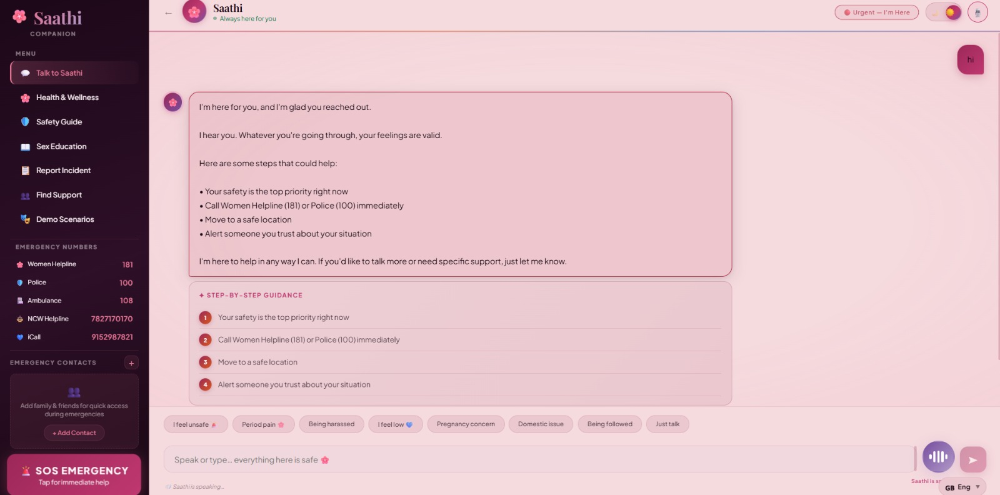

# saathi_AIcompanion
SAATHI is an AI-powered life companion for women that provides a safe space to discuss sensitive issues, offers step-by-step guidance, and connects users to real-world support systems such as helplines, NGOs, and healthcare services.
SAATHI – Intelligent Life Companion for Women

🏆 1st Place – Code for Her Hackathon 2026

SAATHI is an AI-powered life companion designed to support women by providing a safe space to discuss sensitive issues, receive reliable guidance, and connect to real-world support systems.

The platform aims to address challenges faced by women, especially in rural communities, where topics like reproductive health, mental health, harassment, and personal safety are often stigmatized or difficult to discuss openly.

SAATHI listens to users, understands their situation, provides step-by-step guidance, and connects them to appropriate support resources when needed.

Vision

Many women hesitate to ask questions about their health, safety, or emotional struggles due to stigma and lack of trusted support systems.

SAATHI aims to become a trusted digital companion that empowers women through knowledge, guidance, and access to help.

Problem Statement

In many communities, especially rural areas:

Reproductive health and sex education are considered taboo.

Women often hesitate to ask questions about menstruation, pregnancy, or contraception.

Harassment and domestic violence go unreported.

Mental health struggles remain unspoken.

Many women are unaware of support systems such as NGOs, helplines, and healthcare services.

This leads to misinformation, unsafe decisions, and delayed help-seeking.

Solution

SAATHI provides an AI-powered support platform where women can:

Ask sensitive questions privately

Receive reliable and empathetic guidance

Understand their situation and possible options

Connect with real-world support services

The system follows a simple but powerful principle:

Conversation → Understanding → Action

Key Features
Conversational AI Companion

A friendly chat-based interface where users can discuss personal or sensitive issues without fear of judgment.

Situation Intelligence Engine

The AI analyzes conversations to detect the nature of the problem, such as health concerns, emotional distress, harassment, or safety risks.

Guided Action System

SAATHI provides clear, step-by-step guidance to help users handle challenging situations.

Life Navigator

Educational guidance about:

menstrual health

reproductive health

contraception

consent and relationships

emotional wellbeing

Real Support Network

The platform connects users with real-world support resources such as:

NGOs

counsellors

doctors

ASHA workers

women helplines

Emergency SOS System

For urgent situations, SAATHI can:

provide emergency helpline numbers

suggest nearby hospitals or police stations

share location with trusted contacts

help users find safe shelters or support centers

Example Use Cases

SAATHI supports women in many real-life situations:

A schoolgirl confused about her first period

A student experiencing harassment

Someone dealing with emotional distress or depression

A woman facing domestic violence

A person feeling unsafe in public

A young woman with pregnancy concerns

System Architecture

User
↓
Chat Interface
↓
AI Conversation Engine
↓
Situation Detection
↓
Guided Action Planner
↓
Support Network Connector
↓
Emergency & Location Services

Technology Stack

Frontend
React / Next.js
Tailwind CSS

Backend
Node.js
Express.js

AI Layer
LLM API Integration

Database
MongoDB / Firebase

Location Services
Google Maps API

Hackathon MVP

The hackathon prototype focuses on three main capabilities:

AI-powered chat conversation

Situation detection with guided responses

Emergency action system with helpline support

Impact

SAATHI aims to:

break the silence around taboo topics

empower women with reliable information

provide emotional and safety support

connect users to real-world assistance quickly

Future Improvements

Planned enhancements include:

multilingual support for regional languages

integration with government healthcare schemes

partnerships with NGOs and women's support organizations

mobile app deployment for broader accessibility

Demo

This project was developed for the Code for Her Hackathon 2026.
